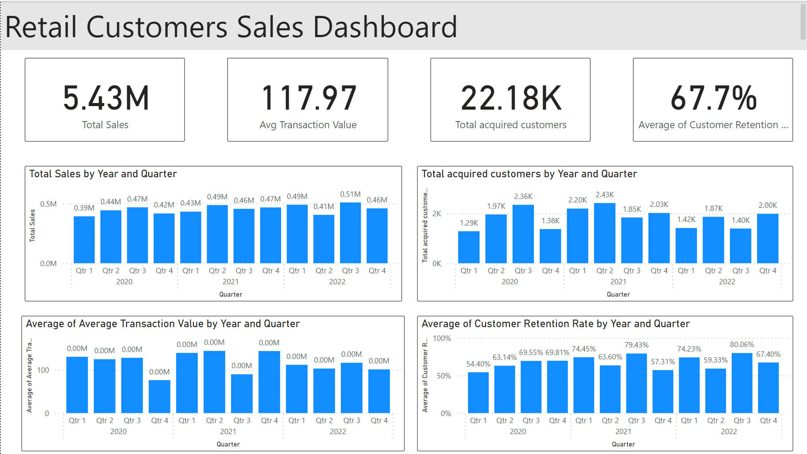

# Retail Customer Dashboard

## Objective

The primary goal of this project is to develop a dynamic and interactive dashboard that provides comprehensive insights into the retail business's monthly performance metrics. This dashboard is designed to empower business leaders and stakeholders with data-driven insights for informed decision-making.

## Stakeholders

- **Business Leaders:** Evaluate business performance and strategize future plans based on data-driven insights provided by the dashboard.
- **Marketing Teams:** Identify customer demographics and preferences, enabling the creation of targeted marketing strategies.
- **Sales Teams:** Determine peak shopping hours and develop strategies to increase sales during these periods.

## Business Problem

In the fast-paced retail environment, real-time insights into business metrics are crucial. The challenge we address is the absence of a centralized system that offers a holistic view of business performance, including sales trends, customer demographics, and peak shopping hours. By consolidating these data points into a single dashboard, we aim to foster a data-driven culture and streamline decision-making processes.

## Dataset

The dataset used in this project is synthetically generated and includes over 1,000 rows of monthly data from January 2020 to December 2022. It covers various key performance indicators (KPIs) such as:

- Monthly Sales
- Average Transaction Value
- Customer Retention Rate
- New Customers Acquired

Additionally, it provides a breakdown of sales across different product categories and customer demographics, offering a granular view of business dynamics.

## Results

Upon completion, the dashboard will offer clear and intuitive visualizations of various KPIs, allowing for:

- Easy tracking of monthly sales trends.
- Identification of peak shopping hours to optimize staff allocation and marketing strategies.
- Analysis of customer demographics to tailor marketing strategies.

The dashboard is designed to be user-friendly, facilitating the easy interpretation of complex data and promoting a data-driven decision-making culture.

## Technologies Used

- **Power BI:** For creating interactive and dynamic visualizations.

## Future Scope

- Integration with real-time data sources to provide live updates on the dashboard.
- Implementation of predictive analytics to forecast future sales trends based on historical data.
- Enhancing the dashboard with additional features such as customer feedback analysis and inventory management insights.

## Conclusion
This project demonstrates the power of leveraging data to drive business decisions. Through a detailed and interactive dashboard, it brings data-driven insights to the fingertips of business leaders and stakeholders, promoting informed decision-making and fostering business growth.